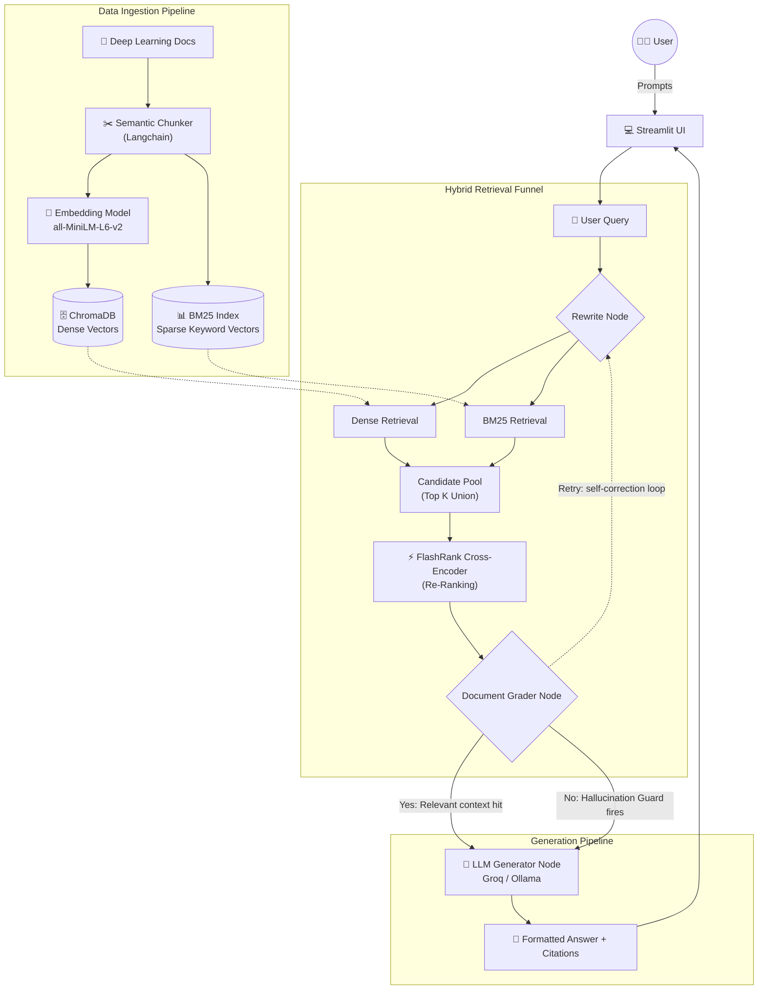

# Deep Learning RAG Interview Prep Agent

A Production-Grade RAG-powered interview preparation agent built with LangChain, LangGraph, and ChromaDB. Upload deep learning study material, chat with it to generate technical interview questions, and get evaluated on your answers.

---

## 🏛 Architecture Diagram



---

## Team

| Name | Role | Owned |
|---|---|---|
| **Sai Charan Rajoju** | Pipeline Engineer | `config.py`, `store.py`, `nodes.py`, `graph.py` |
| **Snehal Teja Adidam** | Corpus Architect | `data/corpus/` — study material chunks |
| **Girivarshini** | UX Lead | `src/rag_agent/ui/app.py` — Streamlit interface |
| **Kishore** | Prompt Engineer | `src/rag_agent/agent/prompts.py` — LLM prompts |
| **Durgi Sai Jashwanth Kumar** | QA Lead | `tests/` — integration tests and demo script |

---

## What We Built

A fully working **Production-ready** RAG agent that:

- Ingests deep learning study material (PDF and Markdown) cleanly segmenting it via **Semantic Chunking**.
- Detects and skips duplicate documents on re-upload using content hashing.
- Rewrites natural language queries into keyword-dense search terms.
- Retrieves the most relevant chunks using a **Hybrid Search Pipeline** combining dense (ChromaDB) and sparse (BM25) methodologies.
- Re-ranks candidate pools with **FlashRank Cross-Encoders** to guarantee context precision.
- Employs a **Self-RAG automated feedback loop** (powered by LangGraph) that actively grades context on the fly and retries retrieval pathways when needed before committing to hallucination fallback.
- Fires a strong hallucination guard when no relevant context is ultimately derived.
- Generates technical interview questions from ingested material and grades users 0-10 on their answers providing detailed missing-concept breakdowns.

---

## How Each Role Contributed

### Sai Charan Rajoju — Pipeline Engineer
Built the backbone of the system. Implemented the full ChromaDB integration in `store.py` including initialisation, content-hash-based duplicate detection, batch ingestion, and corpus inspection. Refactored the generic document splitting strategy into an advanced **Semantic Chunker**. Designed the **Hybrid Retrieval framework**, bridging Chroma vector matching with custom in-memory **BM25Okapi** token sparse indexes. Connected **FlashRank** to cross-evaluate query parity onto candidate chunk pools. Wired together the full self-evaluating **Self-RAG** LangGraph state machine — introducing the `Document Grader` to score retrieve quality, and forcing automated rewrite rerouting prior to the final generation node. 

### Snehal Teja Adidam — Corpus Architect
Authored all study material in `data/corpus/`. Drafted intermediate-level content for ANN, CNN, and RNN covering forward propagation, backpropagation, activation functions, convolution operations, pooling, feature maps, hidden state, BPTT, and the vanishing gradient problem. Located and sourced landmark papers: Rumelhart et al. (1986) for backprop, LeCun et al. (1998) for LeNet, and Hochreiter & Schmidhuber (1997) for LSTM. Ensured every chunk follows the agreed metadata schema (`topic`, `difficulty`, `type`, `source`, `related_topics`, `is_bonus`) and is atomic enough to anchor a single interview question.

### Girivarshini — UX Lead
Built the three-panel Streamlit interface in `app.py`. Panel 1 handles multi-file upload with a per-file progress bar and structured ingestion result display (chunks added, duplicates skipped, errors). Panel 2 is a document viewer with a selectable dropdown and chunk-level expanders showing metadata. Panel 3 is the chat interface with topic and difficulty filters, inline source citations, confidence scores, a rewritten query expander, and a hallucination guard warning. Integrated visibility tracking for Self-RAG `retries` occurrences seamlessly matching them dynamically onto chat bubbles. 

### Kishore — Prompt Engineer
Designed and hardened all prompts in `prompts.py`. The `SYSTEM_PROMPT` defines strict rules preventing the LLM from using general knowledge and enforces citation formatting. The `QUERY_REWRITE_PROMPT` converts conversational interactions to 10-word keyword-dense semantic terms and dynamically shifts logic on self-correction feedback. The `DOCUMENT_GRADER_PROMPT` enforces strict binary Yes/No matching. 

### Durgi Sai Jashwanth Kumar — QA Lead
Wrote five integration tests in `test_vectorstore.py` covering the full pipeline: single chunk ingestion, duplicate detection (same chunk ingested twice skips on second run), retrieval with source citation, hallucination guard (off-topic query returns empty list), and deterministic chunk ID generation. All tests run against isolated ChromaDB instances using `tmp_path` fixtures — no shared state between tests. Wrote the 60-second demo script in `docs/architecture.md` covering all five demo beats in order.

---

## Tech Stack

| Layer | Technology |
|---|---|
| Orchestration | LangChain + LangGraph |
| Vectors/Persistence | ChromaDB (Dense) + BM25Okapi (Sparse) |
| Chunking | Semantic Chunking (`langchain-experimental`) |
| Re-Ranking | `FlashRank` Model (`ms-marco-TinyBERT-v2`) |
| Base LLM | Groq (`llama-3.1-8b-instant`) |
| Embeddings | `sentence-transformers/all-MiniLM-L6-v2` (local, no API key) |
| UI | Streamlit |
| Package Manager | UV |

---

## Getting Started

### 1. Install dependencies
```bash
uv sync
```

### 2. Configure environment
```bash
cp .env.example .env
# Add your GROQ_API_KEY to .env
```

### 3. Run the app
```bash
uv run streamlit run src/rag_agent/ui/app.py
```

### 4. Run the tests
```bash
uv run pytest tests/ -v
```

The app will be available at **http://localhost:8501**.

---

## LLM Provider Options

### Groq (Recommended — free, fast)
```
LLM_PROVIDER=groq
GROQ_API_KEY=your_key_here
GROQ_MODEL=llama-3.1-8b-instant
```
Get a free API key at [console.groq.com](https://console.groq.com).

### Ollama (Local, no API key)
```
LLM_PROVIDER=ollama
OLLAMA_BASE_URL=http://localhost:11434
OLLAMA_MODEL=llama3.2
```
Start with `ollama serve` before running the app.

### LM Studio (Local GUI)
```
LLM_PROVIDER=lmstudio
LMSTUDIO_BASE_URL=http://localhost:1234/v1
LMSTUDIO_MODEL=local-model
```

---

## Project Structure

```
deep-learning-rag-agent/
├── data/corpus/            ← Study material (.md and .pdf)
├── docs/
├── src/rag_agent/
│   ├── config.py           ← LLMFactory, EmbeddingFactory, Settings
│   ├── corpus/chunker.py   ← Semantic PDF and Markdown chunking
│   ├── vectorstore/store.py← ChromaDB & Hybrid Search Pipeline 
│   ├── agent/
│   │   ├── state.py        ← Data models
│   │   ├── prompts.py      ← All LLM prompt templates
│   │   ├── nodes.py        ← LangGraph Grading, Rewriting & Output node functions
│   │   └── graph.py        ← Full State Machine graph assembly
│   └── ui/app.py           ← Streamlit application
├── tests/test_vectorstore.py
├── .env.example
└── pyproject.toml
```

---

## Common Issues

**`ModuleNotFoundError: No module named 'rag_agent'`**
Run from the project root using `uv run`, not `python` directly.

**`chromadb.errors.NotEnoughElementsException`**
Ingest more documents or reduce `RETRIEVAL_K` in `.env`.

**`ollama: connection refused`**
Start Ollama with `ollama serve` in a separate terminal.

**Streamlit loses state on every click**
All persistent objects are wrapped in `@st.cache_resource` — restart the app if state appears corrupted.
